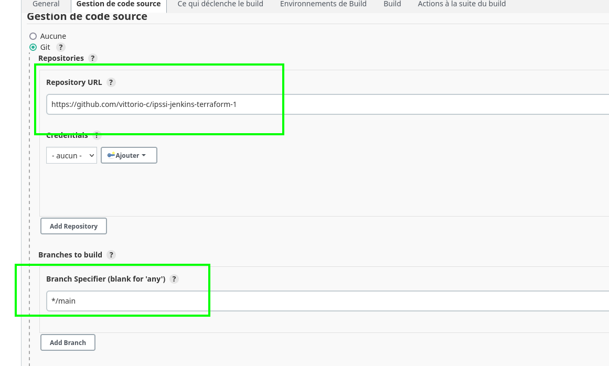
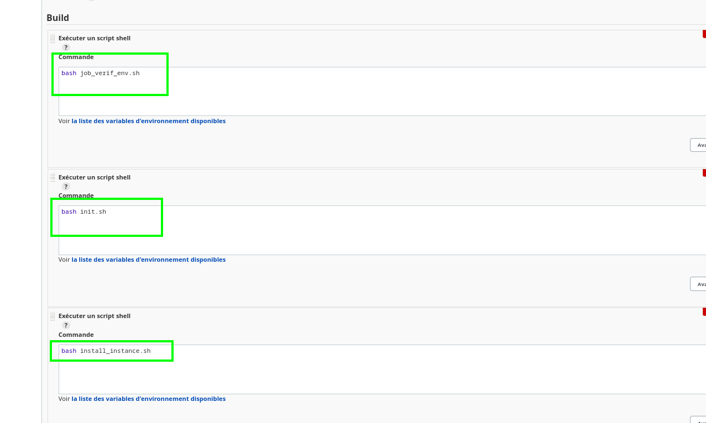
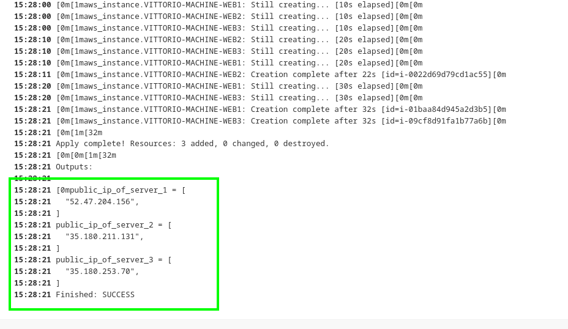

# ipssi-jenkins-terraform-1

Add this repository to jenkins :



And set up three separate steps to perform the job :



This job will deploy 3 webservers and return corresponding public IP adress :



Don't forget to add your AWS "ACCESS_KEY" and "SECRET_KEY" variable to your Jenkins Master :

```
touch /var/jenkins_home/.aws_credentials

echo "<MyAccessKey>" >> /var/jenkins_home/.aws_credentials
echo "<MySecretKey>" >> /var/jenkins_home/.aws_credentials
```

Otherwise terraform won't be able to connect to AWS.

